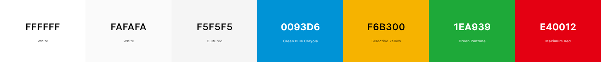
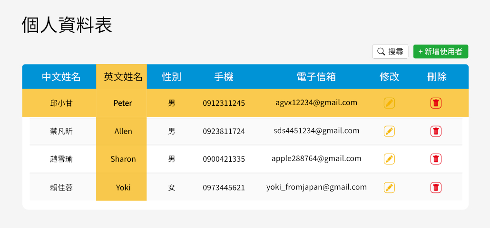
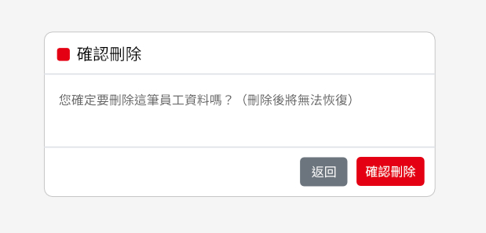
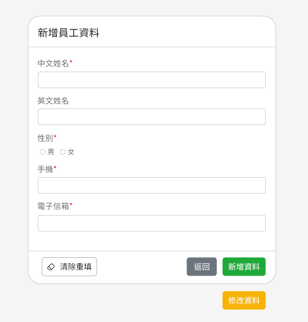

# [個人資料表](https://samchiu064.github.io/nueip/demo/index.html)

## 目錄
- [設計理念](#設計理念)
- [配色](#配色)
- [設計稿](#設計稿)

### 設計理念
配色上以上藍、下黃為主要視覺色彩，藍色象徵著天空的遼闊以及對未來的期待；黃色是麥田、土地的顏色，將其設計成會隨著滑鼠移動，是為了傳達有如麥田被風吹動、充滿生機的感覺，這也象徵著人和土地永遠連結在一起，不論去到什麼地方都告誡自己要腳踏實地、一分耕耘一分收穫。

### 配色

### 設計稿

#### 主視覺圖

#### 刪除確認視窗

#### 表單
